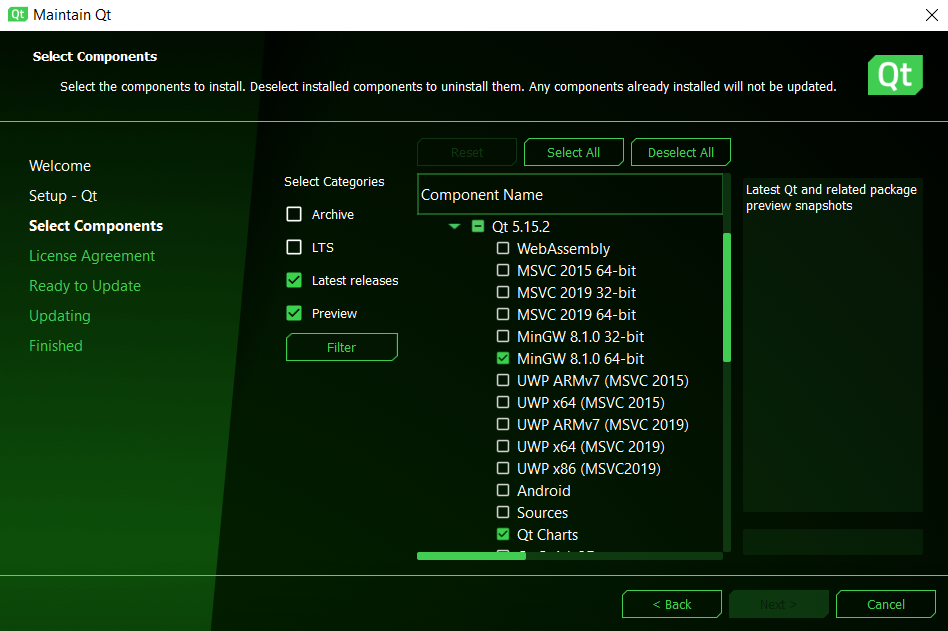

# MoneyKeeper

## Как тестировать?

### Если установлен QT версии 5.15.2 (1)

1. Перейти в папку, куда он был установлен

2. Открыть MaintenanceTool

3. Следуя инструкциям, добавить компонент QtCharts (в подменю QT)

 
<em>MaintenanceTool</em>

### Если установлен QT другой версии (2)

1. Перейти в папку, куда он был установлен

2. Открыть MaintenanceTool

3. Следуя инструкциям, QT 5.15.2 и добавить компонент QtCharts (в подменю QT)

### Если QT не установлен (3)

1. Скачать установщик QT Community [по ссылке](https://www.qt.io/download-qt-installer?hsCtaTracking=99d9dd4f-5681-48d2-b096-470725510d34%7C074ddad0-fdef-4e53-8aa8-5e8a876d6ab4)

2. Выбрать стандартную установку QT 5.15.2*

3. После её окончания повторить действия из (1)

*Второй вариант - при установке выбрать кастомную установку и установить QT вместе с QtCharts